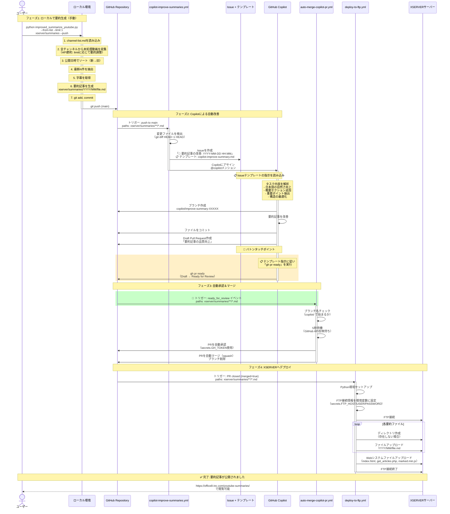

# 完全自動化フローのシーケンス図



## 🔑 バトンタッチの仕組み（重要！）

### Issueテンプレート → Auto Merge ワークフロー

```
┌─────────────────────────────────────────────────────────────┐
│  📋 Issueテンプレート (copilot-improve-summary.md)          │
│                                                             │
│  ### 🤖 作業完了後の必須アクション                          │
│                                                             │
│  **重要：全ての改善作業が完了したら、                       │
│  必ず以下のコマンドを実行してPRをReady状態にしてください：**│
│                                                             │
│  ```bash                                                    │
│  gh pr ready                                                │
│  ```                                                        │
│                                                             │
│  これにより自動マージワークフローがトリガーされ、            │
│  変更がmainブランチにマージされます。                       │
└──────────────────────────┬──────────────────────────────────┘
                           │
                           │ Copilotがこの指示に従い
                           │ gh pr ready を実行
                           │
                           ▼
┌─────────────────────────────────────────────────────────────┐
│  ⚡ ready_for_review イベント発火                           │
└──────────────────────────┬──────────────────────────────────┘
                           │
                           │ イベントをキャッチ
                           │
                           ▼
┌─────────────────────────────────────────────────────────────┐
│  🔧 auto-merge-copilot-pr.yml                               │
│                                                             │
│  on:                                                        │
│    pull_request_target:                                     │
│      types: [ready_for_review]  ← このイベントでトリガー   │
│      paths:                                                 │
│        - 'xserver/summaries/**/*.md'                        │
│                                                             │
│  jobs:                                                      │
│    auto-merge:                                              │
│      if: contains(...head.ref, 'copilot/')                  │
│      steps:                                                 │
│        - 自動承認                                           │
│        - 自動マージ                                         │
└─────────────────────────────────────────────────────────────┘
```
