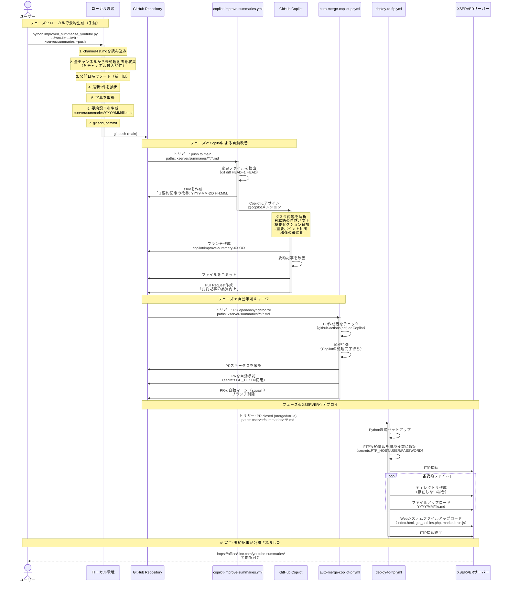

# 完全自動化フローのシーケンス図



## 📊 処理フロー概要

### コマンド実行
```bash
python python/improved_summarize_youtube.py --from-list --limit 1 xserver/summaries --push
```

### 自動実行される処理

| フェーズ | 担当 | 処理内容 | 所要時間 |
|---------|------|---------|---------|
| 1️⃣ 要約生成 | ローカル | 全チャンネルから最新1件を取得し要約記事を生成・プッシュ | 1-2分 |
| 2️⃣ Copilot改善 | GitHub Actions + Copilot | Issueを作成しCopilotが記事を改善してPR作成 | 3-10分 |
| 3️⃣ 自動マージ | GitHub Actions | PRを自動承認＆マージ | 10-20秒 |
| 4️⃣ FTPデプロイ | GitHub Actions | XSERVERへ自動アップロード | 30-60秒 |

### トータル所要時間
- **ユーザー作業**: コマンド1回実行のみ（5秒）
- **自動処理**: 5-15分程度で完全自動公開

## 🔑 必要な設定

### GitHub Secrets
| Secret名 | 用途 | 必須 |
|---------|------|------|
| `GH_TOKEN` | Personal Access Token（PR承認用） | ✅ |
| `FTP_HOST` | FTPサーバーホスト名 | ✅ |
| `FTP_USER` | FTPユーザー名 | ✅ |
| `FTP_PASSWORD` | FTPパスワード | ✅ |

### GH_TOKEN の権限
- `repo` (Full control of private repositories)
- `workflow` (Update GitHub Action workflows)

## 🎯 各ワークフローの役割

### 1. copilot-improve-summaries.yml
**トリガー**: `xserver/summaries/**/*.md`へのpush
- 新規要約ファイルを検出
- Copilotにタスクをアサイン（Issue経由）
- Copilotが記事を改善してPR作成

### 2. auto-merge-copilot-pr.yml
**トリガー**: PRが開かれた時（summariesディレクトリ対象）
- Copilotが作成したPRを自動承認
- squashマージで履歴を綺麗に保つ
- マージ後にブランチ削除

### 3. deploy-to-ftp.yml
**トリガー**: PRがマージされた時
- 変更ファイルをXSERVERへFTPアップロード
- ディレクトリ構造を維持（YYYY/MM/）
- Webシステムファイルも同時アップロード

## ⚠️ 注意点

### PR承認について
- `secrets.GITHUB_TOKEN`（自動生成トークン）では自分のPRを承認できない
- `secrets.GH_TOKEN`（Personal Access Token）を使用する必要がある
- PATは`repo`と`workflow`権限が必要

### エラーハンドリング
- 字幕が取得できない動画は自動スキップ
- FTP接続エラーはワークフローが失敗（ログで確認可能）
- Copilotのタスク失敗時は手動でIssueから再実行可能

## 🔄 繰り返し実行

2回目以降の実行では：
- 既に処理済みの動画は自動スキップ
- 未処理の最新動画のみを処理
- ページネーション機能で次々と古い動画へ進む

```bash
# 1回目: 全チャンネル中で最新1件
python python/improved_summarize_youtube.py --from-list --limit 1 xserver/summaries --push

# 2回目: 1回目の動画をスキップして次の1件
python python/improved_summarize_youtube.py --from-list --limit 1 xserver/summaries --push

# 3回目: 1-2回目をスキップして次の1件
python python/improved_summarize_youtube.py --from-list --limit 1 xserver/summaries --push
```
