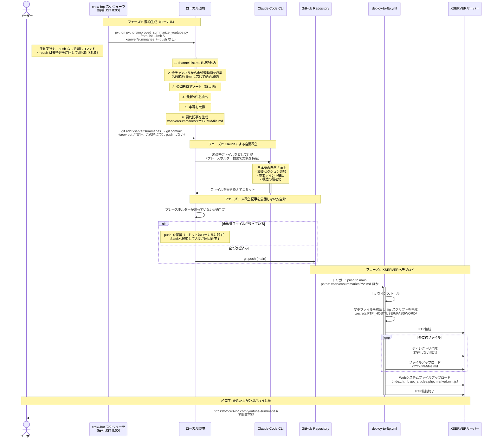

# 完全自動化フローのシーケンス図


```mermaid
sequenceDiagram
    actor User as ユーザー
    participant Cron as crow-bot スケジューラ<br/>（毎朝 JST 8:00）
    participant Local as ローカル環境
    participant Claude as Claude Code CLI
    participant GitHub as GitHub Repository
    participant GHA as deploy-to-ftp.yml
    participant XSERVER as XSERVERサーバー

    %% フェーズ1: 要約記事の生成
    Note over Cron,Local: フェーズ1: 要約生成（ローカル）
    Cron->>Local: python python/improved_summarize_youtube.py<br/>--from-list --limit 5<br/>xserver/summaries（--push なし）
    Note right of User: 手動実行も --push なしで同じコマンド<br/>（--push は安全弁を迂回して即公開される）

    activate Local
    Note over Local: 1. channel-list.mdを読み込み
    Note over Local: 2. 全チャンネルから未処理動画を収集<br/>（API節約: limitに応じて動的調整）
    Note over Local: 3. 公開日時でソート（新→旧）
    Note over Local: 4. 最新N件を抽出
    Note over Local: 5. 字幕を取得
    Note over Local: 6. 要約記事を生成<br/>xserver/summaries/YYYY/MM/file.md
    deactivate Local
    Cron->>Local: git add xserver/summaries → git commit<br/>（crow-bot が実行。この時点では push しない）

    %% フェーズ2: Claudeによる改善
    Note over Local,Claude: フェーズ2: Claudeによる自動改善
    Local->>Claude: 未改善ファイルを渡して起動<br/>（プレースホルダー検出で対象を特定）
    activate Claude
    Note over Claude: - 日本語の自然さ向上<br/>- 概要セクション追加<br/>- 重要ポイント抽出<br/>- 構造の最適化
    Claude->>Local: ファイルを書き換えてコミット
    deactivate Claude

    %% フェーズ3: 安全弁つきpush
    Note over Local,GitHub: フェーズ3: 未改善記事を公開しない安全弁
    Local->>Local: プレースホルダーが残っていないか再判定
    alt 未改善ファイルが残っている
        Note over Local: push を保留（コミットはローカルに残す）<br/>Slackへ通知して人間が原因を直す
    else 全て改善済み
        Local->>GitHub: git push (main)
    end

    %% フェーズ4: FTPアップロード
    Note over GitHub,XSERVER: フェーズ4: XSERVERへデプロイ
    GitHub->>GHA: トリガー: push to main<br/>paths: xserver/summaries/**/*.md ほか
    activate GHA
    GHA->>GHA: lftp をインストール
    GHA->>GHA: 変更ファイルを検出し lftp スクリプトを生成<br/>（secrets.FTP_HOST/USER/PASSWORD）
    GHA->>XSERVER: FTP接続

    loop 各要約ファイル
        GHA->>XSERVER: ディレクトリ作成<br/>（存在しない場合）
        GHA->>XSERVER: ファイルアップロード<br/>YYYY/MM/file.md
    end

    GHA->>XSERVER: Webシステムファイルアップロード<br/>（index.html, get_articles.php, marked.min.js）
    GHA->>XSERVER: FTP接続終了
    deactivate GHA

    %% 完了
    Note over User,XSERVER: ✅ 完了: 要約記事が公開されました
    XSERVER-->>User: https://office8-inc.com/youtube-summaries/<br/>で閲覧可能
```

## 🔑 未改善記事を公開しない安全弁（重要！）

改善フェーズが落ちても生成フェーズのコミットは残る。そのまま push すると
`deploy-to-ftp.yml` が走り、**英語タイトル＋プレースホルダーの記事がそのまま公開される**。
2026-08-20 に Claude CLI の認証切れで日本語化が丸ごと落ち、実際に5本公開された。

```
┌─────────────────────────────────────────────────────────────┐
│  フェーズ2: Claude による改善                               │
│  （crow-bot: _improve_summaries_with_claude）               │
└──────────────────────────┬──────────────────────────────────┘
                           │
                           │ 改善後にもう一度プレースホルダーを機械判定
                           │ （「改善したつもり」で沈黙させない）
                           ▼
┌─────────────────────────────────────────────────────────────┐
│  未改善が残っている  →  push しない ＋ Slack通知            │
│  全部改善済み        →  main へ push → FTPデプロイ          │
└─────────────────────────────────────────────────────────────┘
```

PR を経由しないのは、改善の主体がリポジトリ外（ローカルの Claude）にあり、
レビュー対象になる差分が「生成＋改善」で一体になっているため。
公開前のゲートは PR ではなく、上記のプレースホルダー判定が担う。

## 📜 旧フロー（Copilot coding agent、2026-08-05 に廃止）

以前はフェーズ2〜3を GitHub Copilot coding agent が担当していた。

- `copilot-improve-summaries.yml` が push を検知して issue を作り、`copilot-swe-agent[bot]` にアサイン
- Copilot が `copilot/*` ブランチで改善し Draft PR を作成
- Copilot 自身は `gh pr ready` / approve / merge ができないため、
  `auto-merge-copilot-pr.yml` が `workflow_run`（"Copilot coding agent" 完了）で
  バトンを受けて Ready 化・承認・squash マージを代行

2026-08-03 の Copilot 側ランタイム更新以降、Copilot coding agent が編集ツールを
一度も呼ばずに終了し **0 ファイルの PR** を作るようになったため Claude へ移行した。
2026-09-26 に Copilot を解約したので、上記2ワークフローと issue テンプレートは削除済み
（復活させたい場合は git 履歴から取得できる）。
